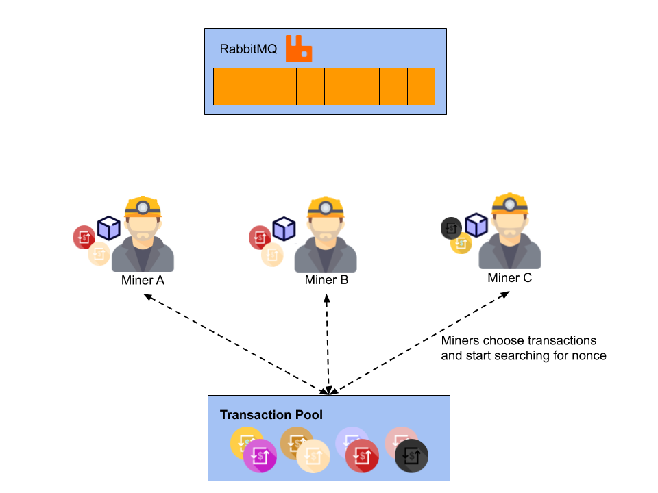
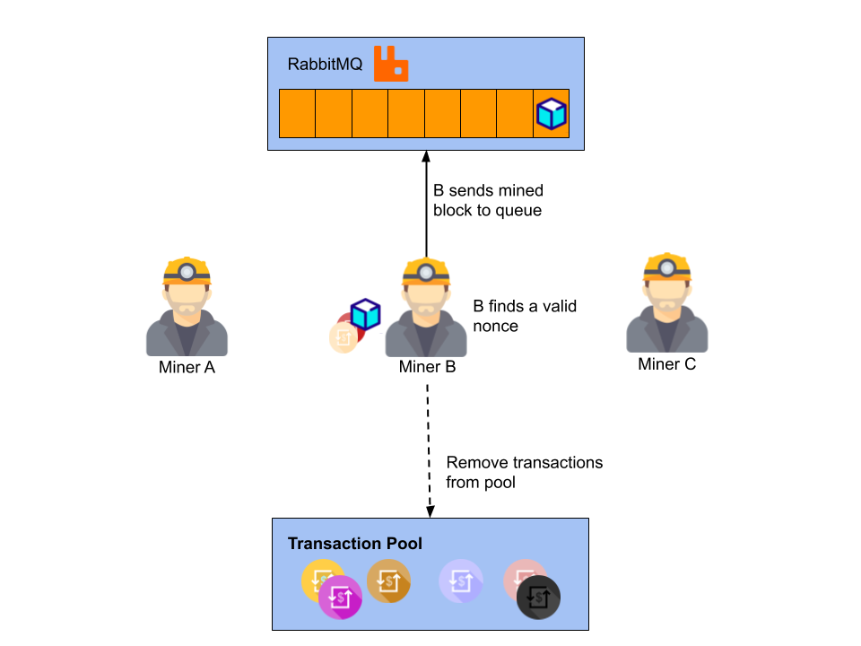
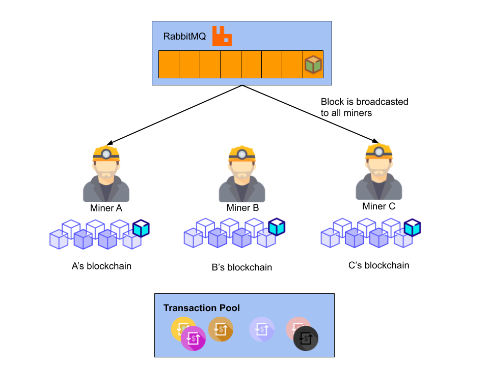

# edublockchain
A blockchain for educational and learning purposes :)

The aim of this project is to create our own blockchain to better understand basic blockchain concepts. 
Here it would be interesting to experiment different consensus approaches, secure transactions, try out the 51% attack, and figure out how to implement a smart contract within a blockchain.

Wanna contribute? Let's have fun together!

<br>

## Architecture

In the architecture of Edublockchain there are three main components: the <b>miner component</b>, a <b>queue (RabbitMQ)</b> used for communication between miners, and the [transaction pool](https://github.com/eduardolfalcao/transaction-pool).

The transaction pool is a component that receives transactions from final userr. Such set of transactions can be accessed by miners to include some transactions in the block to be mined. Note that miners can select different transactions to create different blocks, as depicted on the Figure below.



When a miner finds a valid nonce, she sends this block to the other miners through the RabbitMQ. Meanwhile, the other miners will keep searching for a valid nonce to the blocks they constructed, until they receive the freshly mined block. Note also that the transactions included in the block should be removed (or made invisible), so that duplicates are not included in the blockchain.



As the queue is configured in a publish-subscribe fashion, the other miners will receive the block just mined and include it in the blockchain.



<br>

## Prerequisites

To make use of this project you need both Java11 and Maven. Both [Java11](https://www.oracle.com/technetwork/java/javase/downloads/jdk11-downloads-5066655.html) and [Maven](https://maven.apache.org/install.html) have installation instructions readily available online.

<br>

## Getting Started

To have the miners communicating the fresh mined blocks we use RabbitMQ (though in a real blockchain network, communication is completely decentralized).

```
sudo docker run -d -p 5672:5672 --hostname my-rabbit --name edublockchain-rabbit rabbitmq:3
```

This will start a RabbitMQ container listening on the default port of 5672. If you give wait a minute, then do ```docker logs edublockchain-rabbit```, you'll see in the output something similar to:

```
 Starting broker...2019-12-10 00:24:48.779 [info] <0.262.0>                                                                                  
 node           : rabbit@my-rabbit                                                                                                            
 home dir       : /var/lib/rabbitmq                                                                                                           
 config file(s) : /etc/rabbitmq/rabbitmq.conf                                                                                                 
 cookie hash    : usYzAqYHrXPVfEZoa3Rrsw==
 log(s)         : <stdout>
 database dir   : /var/lib/rabbitmq/mnesia/rabbit@my-rabbit
 ```

<br>

## Project management via Maven 


```bash
mvn validate # Validate project
mvn compile  # Compile Code
mvn test     # Run Tests
mvn package  # Generate Jar from compiled code
mvn verify   # Check integration tests
mvn install  # Install package into the local repository
mvn deploy   # Copy final package to the remote repository
mvn clean    # Clean files/dirs generated by Maven during its build
```
